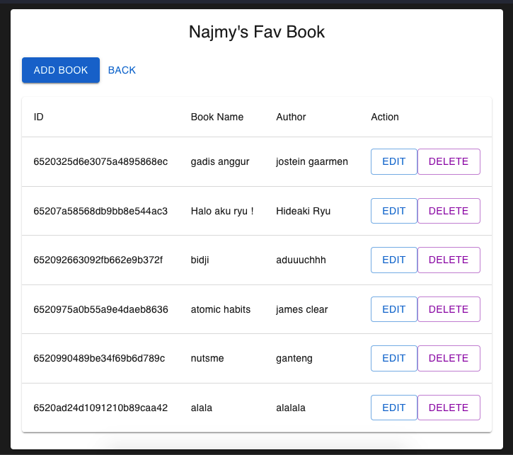

# Book API Documentation Firebase Deployment

This API provides endpoints for managing books. There are two clients (Client X and Client Y) with different access levels.



## Overview

Based on my previous assignment about Frontend and Backend, and integrate those assignment together to build a full end to end product (Book), then deploy my full product to my preffered cloud provider

# Prerequisites

Before we begin, make sure we have the following installed:

- Frontend project with React.js, Vite
- Backend project with Node.js, Express js
- Firebase CLI: Install with `npm install -g firebase-tools`

## Table of Contents

- API Endpoints
  - Create a New Book
  - Get All Books
  - PUT Book
  - DELETE Book
- Client Permissions
    - Origin (GET, POST, PUT, DELETE)
    - Partner Origin (GET, POST) 
- Middleware
  - CORS
  - Helmet
  - Morgan
  - Security XSS

# Getting Started
## API Endpoints

### Create a New Book

- **URL:** `/api/v1/books`
- **Method:** `POST`
- **Request Body:**
  - `name` (string): The name of the book.
  - `author` (string): The author of the book.

#### Example

```json
{
  "name": "The Great Gatsby",
  "author": "F. Scott Fitzgerald"
}
```

### Response
```json
{
  "id": 1,
  "name": "The Great Gatsby",
  "author": "F. Scott Fitzgerald"
}
```

### Get all Book

- **URL:** `/api/v1/books`
- **Method:** `GET`

### Update a Book

- **URL:** `/api/v1/books${id}`
- **Method:** `PUT`
- **New Books:**
    - `_id` (string): new book id
  - `name` (string): New update book name.
  - `author` (string): New update book author.

### Delete a Book

- **URL:** `/api/v1/books${id}`
- **Method:** `DELETE`

# Client Permissions
- There is 3 api in this site that allowed to acces from this site
    - **Najmy's Api** Can perform all methods (GET, POST, UPDATE, DELETE).
    - **Deffi's Api** Can only perform GET and POST methods.
    - **Avicena's Api** Can only perform GET and POST methods.

## Middleware
### CORS

Cross-Origin Resource Sharing (CORS) is configured to allow all origins for Client X and only permit GET and POST for Client Y.

### Helmet

Helmet is used to secure the application by setting various HTTP headers.

### Morgan

Morgan is an HTTP request logger middleware for logging requests.

### Security XSS

XSS protection is implemented both on the server and client side to prevent cross-site scripting attacks.

Feel free to customize this template according to your specific needs and add more details as required.


## Deployment

### 1. Firebase Project Setup

1. Go to the [Firebase Console](https://console.firebase.google.com/).
2. Click on "Add Project" and follow the instructions to create a new project.
3. Once the project is created, note the Project ID.

### 2. Configure Firebase

1. Navigate to the `<project name>` directory: `cd <project name>`.
2. Install dependencies: `pnpm/npm/yarn install`.
3. Authenticate with Firebase: `firebase login`.
4. Initialize Firebase project: `firebase init`.
   - Choose functions.
   - Associate the project with the Firebase project you created.
   - Select JavaScript or TypeScript based on your project.
   - Configure other options as needed.

### 3. Deploy Backend

Run the following commands to deploy the Firebase Functions:

```bash
cd backend
firebase deploy --only functions
```

### 4. Deploy Frontend

Run the following commands to deploy the Firebase Functions:

```bash
cd frontend
build the project
firebase deploy --only hosting:
```


[Try me!!](https://week-17-mnajmytsss.web.app/)


